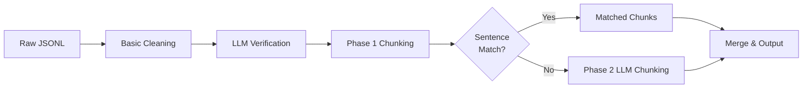

# BilingualForge 🔥

**Transform bilingual JSONL datasets into clean, production-ready English-Hindi parallel corpora.**

BilingualForge is a comprehensive Python pipeline for processing bilingual datasets. It takes raw JSONL files (like those from PDF extraction tools) and produces high-quality, chunked, and aligned English-Hindi datasets ready for NLP model training.

---

## ✨ Features

- 🧹 **Smart Text Cleaning** - Removes newlines, normalizes whitespace, handles special characters
- 🤖 **LLM-Powered Verification** - Optional AI-based translation verification and deep cleaning
- ✂️ **Intelligent Chunking** - Splits long texts into semantic 3-sentence chunks
- 🔄 **Dual-Phase Processing** - Automatic chunking + LLM-assisted alignment for complex cases
- 📊 **Quality Filtering** - Built-in validation and quality scoring
- 🚀 **Google Colab Ready** - Complete notebook for one-click processing
- 🔌 **Provider-Agnostic LLM** - Works with OpenRouter, OpenAI, or local models

---

## 🎯 What It Does

**Input:** Raw bilingual JSONL with potential formatting issues
```json
{"english": "Long text\\nwith\\nnewlines and 5 sentences...", "hindi": "लंबा पाठ\\nसमस्याओं के साथ..."}
```

**Output:** Clean, chunked, aligned dataset
```json
{"english": "Sentence 1. Sentence 2. Sentence 3.", "hindi": "वाक्य 1। वाक्य 2। वाक्य 3।"}
{"english": "Sentence 4. Sentence 5.", "hindi": "वाक्य 4। वाक्य 5।"}
```

---

## 🚀 Quick Start

### Option 1: Google Colab (Recommended)

1. Open the notebook: `Bilingual_Dataset_Processing_Pipeline.ipynb` in [Google Colab](https://colab.research.google.com)
2. Set your OpenRouter API key in the first cell
3. Upload your `input.jsonl` file
4. Click **Runtime → Run All**
5. Download `final_output.jsonl`

**Done in 5 minutes!** ⚡

### Option 2: Local Python Scripts

```bash
# Clone repository
git clone https://github.com/yourusername/BilingualForge.git
cd BilingualForge

# Install dependencies
pip install -r requirements.txt

# Configure API key (if using LLM features)
# Edit config.py and set LLM_API_KEY

# Run the pipeline
python3 clean_pib_bilingual.py          # Step 1: Basic cleaning
python3 llm_clean_bilingual.py          # Step 2: LLM verification (optional)
python3 chunk_sentences_phase1.py       # Step 3: Auto chunking
python3 chunk_sentences_phase2.py       # Step 4: LLM chunking (for mismatches)

# Merge results
cat pib_chunked_matched.jsonl pib_chunked_llm_aligned.jsonl > final_dataset.jsonl
```

---

## 📋 Pipeline Stages



### Stage 1: Basic Cleaning
- Removes `\n` newlines
- Normalizes whitespace
- Cleans special characters
- **Speed:** ~100 entries/second

### Stage 2: LLM Deep Cleaning (Optional)
- Verifies semantic alignment
- Removes formatting artifacts
- Flags misaligned translations
- **Speed:** ~2 entries/second (API limited)

### Stage 3: Phase 1 Chunking
- Splits into sentences
- Creates 3-sentence chunks
- Aligns by position
- **Speed:** ~50 entries/second

### Stage 4: Phase 2 LLM Chunking
- Handles sentence count mismatches
- AI-powered semantic alignment
- Processes only failed entries from Phase 1
- **Speed:** ~1 entry/second (API limited)

---

## 📦 Installation

### Requirements
- Python 3.8+
- `openai` package (for LLM features)

### Setup
```bash
pip install -r requirements.txt
```

### Configuration
Edit `config.py`:
```python
# LLM Configuration (optional)
LLM_API_KEY = "your-openrouter-api-key"
LLM_BASE_URL = "https://openrouter.ai/api/v1"
LLM_MODEL = "meta-llama/llama-3.1-8b-instruct:free"

# Processing Settings
CHUNK_SIZE = 3  # Sentences per chunk
```

---

## 📊 File Structure

```
BilingualForge/
├── 📓 Bilingual_Dataset_Processing_Pipeline.ipynb  # Google Colab notebook
├── 🐍 clean_pib_bilingual.py                      # Step 1: Basic cleaning
├── 🤖 llm_clean_bilingual.py                      # Step 2: LLM verification
├── ✂️ chunk_sentences_phase1.py                   # Step 3: Auto chunking
├── 🧠 chunk_sentences_phase2.py                   # Step 4: LLM chunking
├── ⚙️ config.py                                    # Configuration
├── 📋 requirements.txt                             # Dependencies
├── 📖 README.md                                    # This file
└── 📝 PRD.txt                                      # Product requirements
```

---

## 💡 Usage Examples

### Process Government Documents (PIB)
```bash
# Input: pib_bilingual.jsonl (raw PIB data)
python3 clean_pib_bilingual.py
python3 llm_clean_bilingual.py
python3 chunk_sentences_phase1.py
# Output: Clean, chunked government datasets
```

### Process Educational Content (NCERT)
```bash
# Same pipeline works for any bilingual JSONL!
# Just rename your input to pib_bilingual.jsonl
```

### Custom Processing
Modify chunk size in scripts:
```python
eng_chunks = chunk_into_groups(eng_sentences, 2)  # 2-sentence chunks
```

---

## 🎓 Use Cases

- **Machine Translation Models** - Training data for English↔Hindi MT
- **Multilingual NLP** - Parallel corpora for cross-lingual models
- **Dataset Creation** - Clean datasets from messy PDFs
- **Quality Analysis** - Verify translation alignment
- **Research** - Linguistic analysis of bilingual texts

---

## 📈 Performance

| Dataset Size | With LLM | Without LLM |
|--------------|----------|-------------|
| 100 entries  | ~2 min   | ~5 sec      |
| 500 entries  | ~7 min   | ~20 sec     |
| 1000 entries | ~15 min  | ~40 sec     |

*Times are approximate and depend on API rate limits and system specs*

---

## 🤝 Contributing

Contributions welcome! Ideas for improvement:
- Support for more language pairs
- OCR integration for scanned documents
- Web interface
- Embedding-based semantic alignment
- Quality metrics dashboard

---

## 📄 License

MIT License - feel free to use for research and commercial projects.

---

## 🙏 Acknowledgments

- Built for processing bilingual datasets from various sources
- Inspired by the need for high-quality parallel corpora
- Uses OpenRouter's free tier for LLM features

---

## 📞 Support

**Issues?** Check the documentation in each script's docstring.

**Questions?** Create an issue on GitHub.

---

## 🚀 Getting Started Checklist

- [ ] Clone repository
- [ ] Install dependencies (`pip install -r requirements.txt`)
- [ ] Get OpenRouter API key (optional, from https://openrouter.ai)
- [ ] Set API key in `config.py` or Colab notebook
- [ ] Prepare your raw JSONL file
- [ ] Run pipeline or use Colab notebook
- [ ] Download clean, chunked dataset
- [ ] Train your bilingual models! 🎉

---

**Happy Dataset Processing! 🔥**
# NICO-forge2.0
